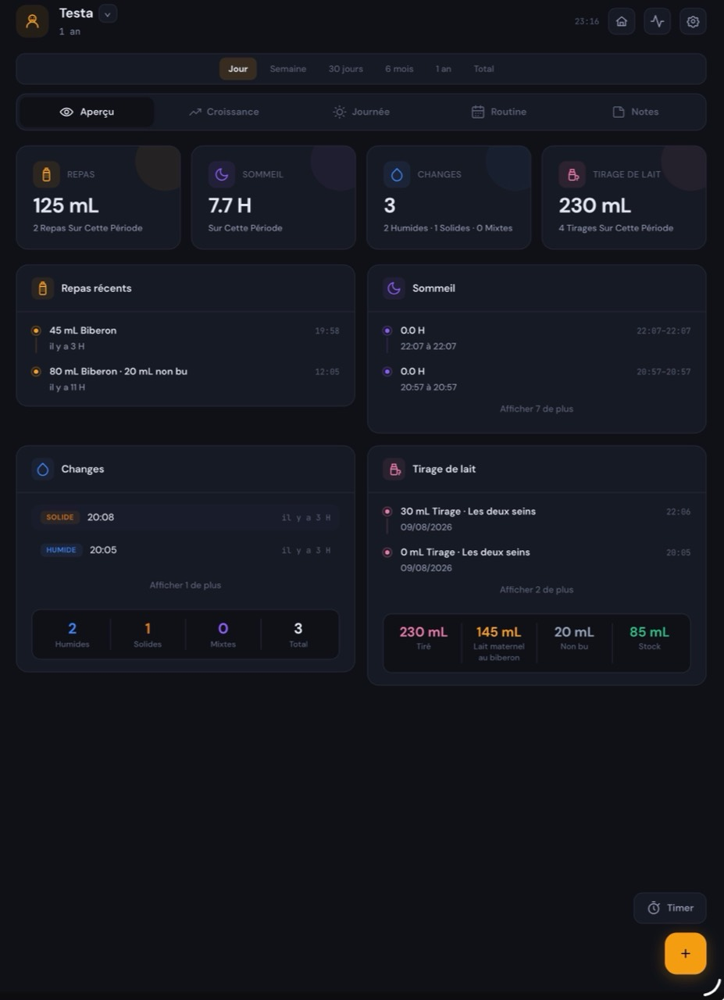
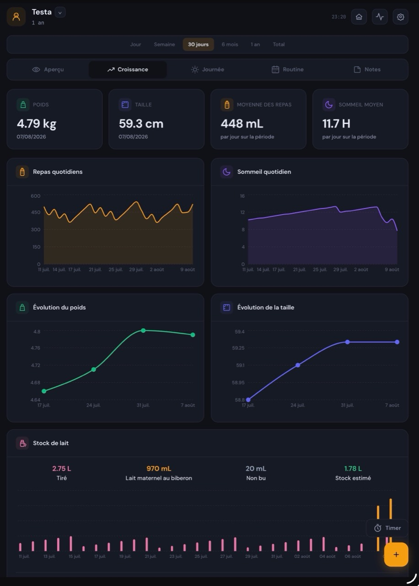
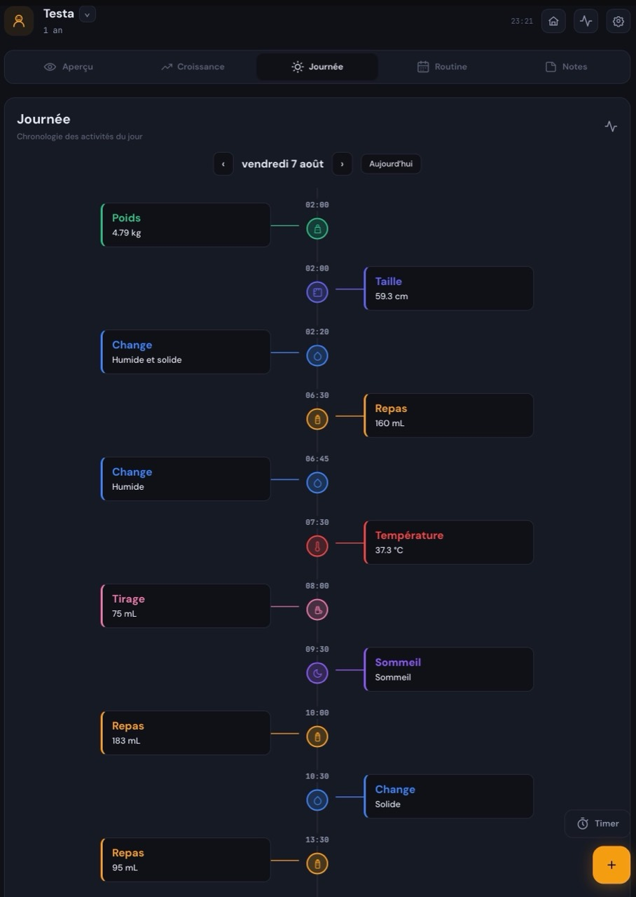
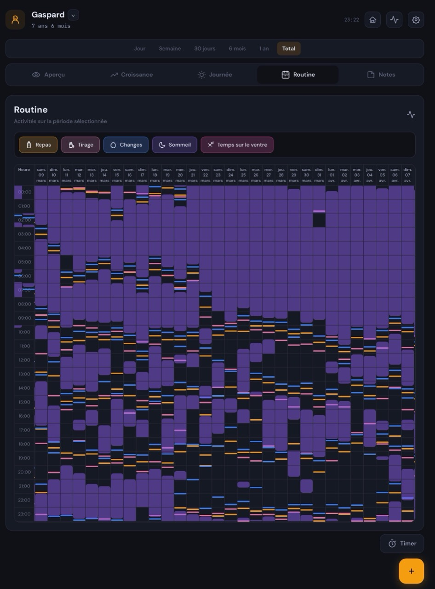
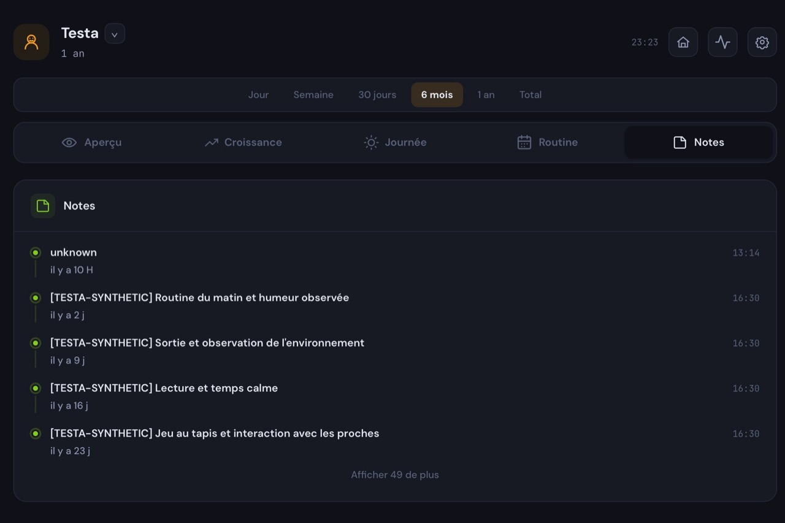
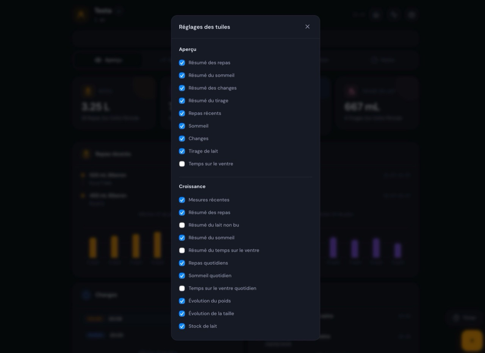

# Baby Buddy Dashboard Rework

An independent, French-first dashboard for [Baby Buddy](https://github.com/babybuddy/babybuddy), available as a Home Assistant add-on, a standalone Docker container, or a local development application.

This project is derived from [mbentancour/baby-buddy-dashboard](https://github.com/mbentancour/baby-buddy-dashboard) and distributed under the MIT License. It keeps the original architecture while adding an extensively reworked interface and data model.

[Documentation française](README.fr.md)

## Features

- Overview, Growth, Day, Routine, and Notes views
- Responsive desktop, tablet, and mobile interface
- Quick create, edit, and delete forms
- Feeding, sleep, diaper, pumping, tummy-time, measurement, and note tracking
- Configurable periods, charts, cards, and per-browser preferences
- Estimated breast-milk stock and dashboard-only uneaten-milk occurrences
- French localization of Baby Buddy activity data

Uneaten milk is stored by this dashboard in `/data/milk-waste.json`. It reduces the amount actually consumed but is never sent to Baby Buddy as another feeding and is never deducted from stock a second time.

## Screenshots

<table>
  <tr>
    <td align="center"><strong>Overview</strong><br></td>
    <td align="center"><strong>Growth and milk stock</strong><br></td>
  </tr>
  <tr>
    <td align="center"><strong>Day timeline</strong><br></td>
    <td align="center"><strong>Routine</strong><br></td>
  </tr>
  <tr>
    <td align="center"><strong>Notes</strong><br></td>
    <td align="center"><strong>Personalized tiles</strong><br></td>
  </tr>
</table>

## Home Assistant add-on

1. Open **Settings > Add-ons > Add-on Store**.
2. Open **Repositories** from the three-dot menu.
3. Add:

   ```text
   https://github.com/Flifette/baby-buddy-rework
   ```

4. Install **Baby Buddy Dashboard Rework**.
5. Configure the Baby Buddy URL and API key, then start the add-on.

The add-on retains the historical slug `baby-buddy-dashboard` so existing installations and their `/data` remain compatible. Consequently, this fork and the original add-on cannot be installed side-by-side in the same Home Assistant instance.

Supported Home Assistant architectures: `amd64` and `aarch64`. The legacy 32-bit base images previously declared by the upstream repository are no longer published for the selected Home Assistant Python base.

## Docker Compose

Clone this repository, create the environment file, and build the dashboard from the checked-out source:

```bash
cp .env.example .env
docker compose up -d --build
```

For an existing Baby Buddy server, set `BABY_BUDDY_URL` in `.env` to an address reachable from the container.

To run Baby Buddy and the dashboard together:

```bash
docker compose --profile full up -d --build
```

Baby Buddy is then available on port `8000`, and the dashboard on port `8099`. The named volumes `babybuddy_data` and `dashboard_data` preserve their respective data.

## Standalone Docker

```bash
docker build -t baby-buddy-dashboard-rework .
docker run -d --name baby-buddy-dashboard-rework \
  -p 8099:8099 \
  -e BABY_BUDDY_URL=http://your-baby-buddy:8000 \
  -e BABY_BUDDY_API_KEY=your_api_key \
  -v baby-buddy-dashboard-data:/data \
  baby-buddy-dashboard-rework
```

Release images may also be published as `ghcr.io/flifette/baby-buddy-rework:<version>`. The source-build commands above remain the canonical installation path and do not depend on package visibility.

## Local development

Requirements: Node.js 20 or newer, Python 3.10 or newer, and a reachable Baby Buddy instance.

```bash
cp .env.example .env
./run_local.sh
```

On Windows PowerShell:

```powershell
Copy-Item .env.example .env
.\run_local.ps1
```

The frontend runs on `http://localhost:5173` and the backend on `http://localhost:8099`. Local dashboard data is written under the ignored `.local-data` directory.

## Configuration

| Variable | Purpose | Default |
| --- | --- | --- |
| `BABY_BUDDY_URL` | Baby Buddy base URL | `http://babybuddy:8000` |
| `BABY_BUDDY_API_KEY` | Baby Buddy API token | required outside demo mode |
| `REFRESH_INTERVAL` | Polling interval in seconds | `30` |
| `UNIT_SYSTEM` | `metric` or `imperial` labels | `metric` |
| `DEMO_MODE` | Use demonstration data | `false` |
| `TZ` | Container timezone | `Europe/Paris` |
| `MILK_WASTE_FILE` | Standalone persistence file | `/data/milk-waste.json` |

Keep `.env`, API keys, runtime data, backups, and temporary scripts out of Git.

## Build and test

```bash
cd baby-buddy-dashboard/frontend
npm ci
npm test
npm run build
```

GitHub Actions validates the frontend, Python backend, add-on metadata, standalone image, and all declared Home Assistant architectures. Version tags can publish a multi-architecture standalone image to GHCR.

## License and attribution

Licensed under the [MIT License](LICENSE). See [NOTICE](NOTICE) for upstream attribution and modification details.
