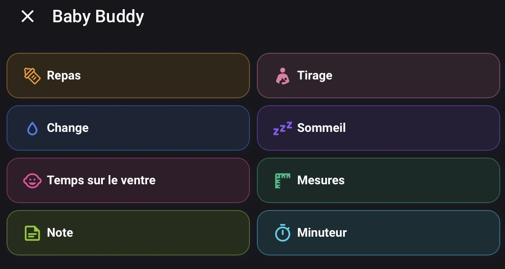
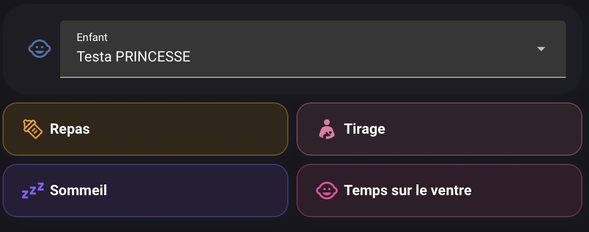
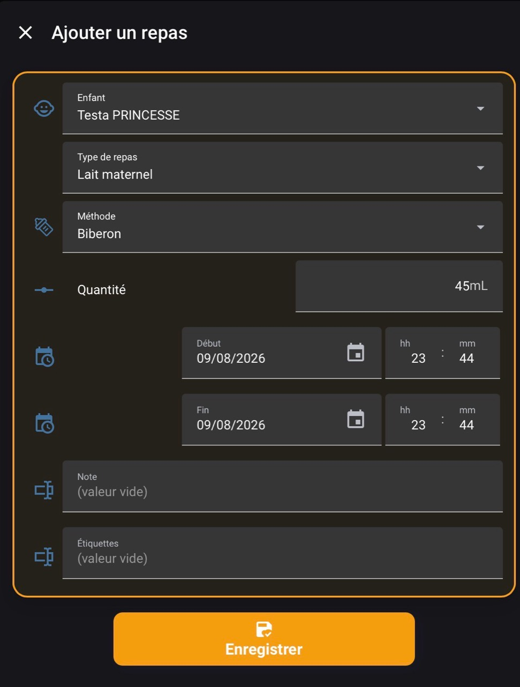
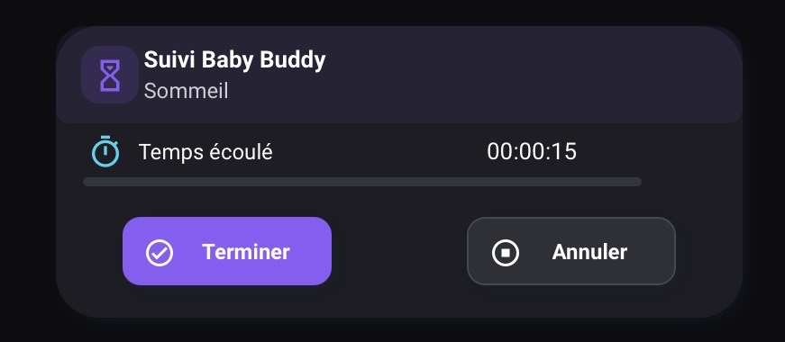

# Exemples Home Assistant pour Baby Buddy

Ce document présente une base générique pour créer dans Home Assistant des formulaires Lovelace reliés à Baby Buddy, indépendamment de l’add-on Baby Buddy Dashboard Rework. Les cartes peuvent être insérées dans une vue existante, un tableau de bord dédié ou des popups.

La configuration permet d’enregistrer les repas, tirages, changes, sommeils, temps sur le ventre, mesures, notes et activités chronométrées. La liste des enfants est récupérée automatiquement depuis l’API Baby Buddy : aucun nom d’enfant n’est codé en dur.

> Les adresses, noms et jetons sont uniquement des exemples. Ne publiez jamais un jeton API réel. Testez d’abord chaque action depuis **Outils de développement > Actions**.

Les noms d’actions et leurs champs ont été contrôlés avec l’intégration communautaire [jcgoette/baby_buddy_homeassistant](https://github.com/jcgoette/baby_buddy_homeassistant). Ils peuvent évoluer avec cette intégration.

## Aperçu

<table>
  <tr>
    <td align="center"><strong>Menu d’actions</strong><br></td>
    <td align="center"><strong>Actions rapides</strong><br></td>
  </tr>
  <tr>
    <td align="center"><strong>Formulaire de repas</strong><br></td>
    <td align="center"><strong>Activité chronométrée</strong><br></td>
  </tr>
</table>

## 1. Prérequis

Obligatoires :

- Home Assistant ;
- une instance Baby Buddy accessible depuis Home Assistant ;
- l’intégration communautaire Home Assistant Baby Buddy et ses actions `babybuddy.add_*` ;
- un jeton API Baby Buddy ;
- une entité par enfant exposant l’attribut stable `id`.

Facultatifs pour les popups et une présentation avancée :

- Button Card ;
- Browser Mod ;
- Card Mod ;
- Layout Card ;
- Vertical Stack In Card.

Les exemples minimaux utilisent les cartes natives `entities`, `grid`, `vertical-stack` et `button`.

## 2. Secrets

À placer dans `secrets.yaml` :

```yaml
babybuddy_children_api_url: "https://baby-buddy.example.com/api/children/?limit=100"
babybuddy_api_token: "REMPLACER_PAR_LE_JETON_API"
```

## 3. Helpers

Ce bloc peut être placé dans un package, par exemple `packages/babybuddy_forms.yaml`.

```yaml
input_select:
  babybuddy_enfant:
    name: Enfant Baby Buddy
    options: [Chargement...]
    icon: mdi:baby-face-outline

  babybuddy_change_type:
    name: Type de change
    options: [Humide, Solide, Humide et solide]
    initial: Humide
    icon: mdi:water

  babybuddy_change_couleur:
    name: Couleur du change
    options: [Non précisée, Noir, Marron, Vert, Jaune]
    initial: Non précisée
    icon: mdi:palette

  babybuddy_alimentation_type:
    name: Type de repas
    options: [Lait maternel, Lait infantile, Lait maternel enrichi, Aliment solide]
    initial: Lait maternel
    icon: mdi:bottle-baby

  babybuddy_alimentation_methode:
    name: Méthode d’alimentation
    options: [Biberon, Sein gauche, Sein droit, Les deux seins, Nourri par un parent, Autonome]
    initial: Biberon
    icon: mdi:baby-bottle-outline

  babybuddy_tirage_sein:
    name: Sein utilisé pour le tirage
    options: [Sein gauche, Sein droit, Les deux seins]
    initial: Les deux seins
    icon: mdi:human-female

  babybuddy_timer_activite:
    name: Activité Baby Buddy en cours
    options: [Repas, Tirage, Sommeil, Temps sur le ventre]
    initial: Repas
    icon: mdi:timer-outline

input_boolean:
  babybuddy_siest:
    name: Sieste
    icon: mdi:sleep

input_datetime:
  babybuddy_debut:
    name: Début
    has_date: true
    has_time: true
  babybuddy_fin:
    name: Fin
    has_date: true
    has_time: true
  babybuddy_date_mesure:
    name: Date de mesure
    has_date: true
    has_time: false

input_text:
  babybuddy_note:
    name: Note
    initial: ""
    max: 255
  babybuddy_tags:
    name: Étiquettes
    initial: ""
    max: 255
  babybuddy_jalon_ventre:
    name: Jalon temps sur le ventre
    initial: ""
    max: 255
    icon: mdi:baby

input_number:
  babybuddy_quantite_repas:
    name: Quantité du repas
    min: 0.1
    max: 500
    step: 0.1
    unit_of_measurement: mL
    mode: box
  babybuddy_quantite_tirage:
    name: Quantité du tirage
    min: 0.1
    max: 500
    step: 0.1
    unit_of_measurement: mL
    mode: box
  babybuddy_poids:
    name: Poids
    min: 0.1
    max: 100
    step: 0.01
    unit_of_measurement: kg
    mode: box
  babybuddy_taille:
    name: Taille
    min: 0.1
    max: 250
    step: 0.1
    unit_of_measurement: cm
    mode: box
  babybuddy_temperature:
    name: Température
    min: 30
    max: 45
    step: 0.1
    unit_of_measurement: °C
    mode: box
  babybuddy_perimetre_cranien:
    name: Périmètre crânien
    min: 0.1
    max: 100
    step: 0.1
    unit_of_measurement: cm
    mode: box
  babybuddy_imc:
    name: IMC
    min: 0.1
    max: 100
    step: 0.1
    mode: box

timer:
  babybuddy_activite:
    name: Activité Baby Buddy
    duration: "24:00:00"
```

Ce socle contient 22 helpers : sept sélecteurs, sept nombres, trois dates, trois textes, un booléen et un minuteur.

## 4. Capteur REST des enfants

```yaml
rest:
  - resource: !secret babybuddy_children_api_url
    method: GET
    headers:
      Authorization: !secret babybuddy_api_token
      Accept: application/json
    scan_interval: 60
    sensor:
      - name: Baby Buddy API Children
        unique_id: babybuddy_api_children
        value_template: "{{ value_json.count | default(0) }}"
        json_attributes: [results]
```

Le capteur créé est `sensor.baby_buddy_api_children`.

## 5. Synchronisation automatique du sélecteur

```yaml
automation:
  - id: babybuddy_sync_children
    alias: Baby Buddy - Synchroniser les enfants
    mode: restart
    triggers:
      - trigger: homeassistant
        event: start
      - trigger: state
        entity_id: sensor.baby_buddy_api_children
      - trigger: time_pattern
        minutes: "/1"
    actions:
      - wait_template: >-
          {{ state_attr('sensor.baby_buddy_api_children', 'results') is not none }}
        timeout: "00:02:00"
        continue_on_timeout: false
      - variables:
          current_child: "{{ states('input_select.babybuddy_enfant') }}"
          api_children: >-
            {{ state_attr('sensor.baby_buddy_api_children', 'results') | default([], true) }}
          child_options: >-
            
            
            
              
              
              
                
                
                  
                
              
              
              
                
              
            
            {{ ns.options | sort }}
      - condition: template
        value_template: "{{ child_options | count > 0 }}"
      - variables:
          selected_option: >-
            {{ current_child if current_child in child_options else child_options[0] }}
      - if:
          - condition: template
            value_template: "{{ state_attr('input_select.babybuddy_enfant', 'options') != child_options }}"
        then:
          - action: input_select.set_options
            target:
              entity_id: input_select.babybuddy_enfant
            data:
              options: "{{ child_options }}"
      - if:
          - condition: template
            value_template: "{{ states('input_select.babybuddy_enfant') != selected_option }}"
        then:
          - action: input_select.select_option
            target:
              entity_id: input_select.babybuddy_enfant
            data:
              option: "{{ selected_option }}"
```

Cette automatisation conserve la sélection, accepte un nombre variable d’enfants et distingue les homonymes avec leur identifiant Baby Buddy.

## 6. Résolution dynamique de l’enfant

```yaml
script:
  babybuddy_resolve_child:
    alias: Baby Buddy - Résoudre l’enfant sélectionné
    mode: parallel
    sequence:
      - variables:
          selected_child: "{{ states('input_select.babybuddy_enfant') }}"
          api_children: >-
            {{ state_attr('sensor.baby_buddy_api_children', 'results') | default([], true) }}
      - variables:
          child_id: >-
            
            
              
              
              
                
                
                  
                
              
              
              
                
              
            
            {{ ns.id }}
      - variables:
          child_entity: >-
            
            
              
                
              
            
            {{ ns.entity }}
      - if:
          - condition: template
            value_template: "{{ child_entity == '' or (expand(child_entity) | count == 0) }}"
        then:
          - action: persistent_notification.create
            data:
              title: Enfant Baby Buddy introuvable
              message: >-
                Aucun enfant valide ne correspond à « {{ selected_child }} ».
                Aucune donnée n’a été enregistrée.
          - stop: Enfant Baby Buddy introuvable
            error: true
      - variables:
          response:
            child: "{{ child_entity }}"
            id: "{{ child_id }}"
            name: "{{ selected_child }}"
      - stop: Enfant Baby Buddy résolu
        response_variable: response
```

## 7. Préparation des formulaires

```yaml
script:
  babybuddy_prepare_form:
    alias: Baby Buddy - Préparer le formulaire
    mode: restart
    sequence:
      - action: input_datetime.set_datetime
        target:
          entity_id:
            - input_datetime.babybuddy_debut
            - input_datetime.babybuddy_fin
        data:
          timestamp: "{{ now().timestamp() }}"
      - action: input_datetime.set_datetime
        target:
          entity_id: input_datetime.babybuddy_date_mesure
        data:
          date: "{{ now().strftime('%Y-%m-%d') }}"
```

## 8. Scripts d’enregistrement

Tous les scripts résolvent d’abord l’enfant, lisent les helpers puis appellent l’action correspondante.

| Script | Action Baby Buddy |
|---|---|
| `babybuddy_add_feeding` | `babybuddy.add_feeding` |
| `babybuddy_add_pumping` | `babybuddy.add_pumping` |
| `babybuddy_add_diaper_change` | `babybuddy.add_diaper_change` |
| `babybuddy_add_sleep` | `babybuddy.add_sleep` |
| `babybuddy_add_tummy_time` | `babybuddy.add_tummy_time` |
| `babybuddy_add_weight` | `babybuddy.add_weight` |
| `babybuddy_add_height` | `babybuddy.add_height` |
| `babybuddy_add_temperature` | `babybuddy.add_temperature` |
| `babybuddy_add_head_circumference` | `babybuddy.add_head_circumference` |
| `babybuddy_add_bmi` | `babybuddy.add_bmi` |
| `babybuddy_add_note` | `babybuddy.add_note` |

```yaml
script:
  babybuddy_add_feeding:
    alias: Baby Buddy - Ajouter un repas
    mode: queued
    sequence:
      - action: script.babybuddy_resolve_child
        response_variable: babybuddy_child
      - variables:
          child: "{{ babybuddy_child.child }}"
          feeding_type: >-
            {{ {
              'Lait maternel': 'Breast milk',
              'Lait infantile': 'Formula',
              'Lait maternel enrichi': 'Fortified breast milk',
              'Aliment solide': 'Solid food'
            }[states('input_select.babybuddy_alimentation_type')] }}
          feeding_method: >-
            {{ {
              'Biberon': 'Bottle',
              'Sein gauche': 'Left breast',
              'Sein droit': 'Right breast',
              'Les deux seins': 'Both breasts',
              'Nourri par un parent': 'Parent fed',
              'Autonome': 'Self fed'
            }[states('input_select.babybuddy_alimentation_methode')] }}
      - action: babybuddy.add_feeding
        data:
          child: "{{ child }}"
          type: "{{ feeding_type }}"
          method: "{{ feeding_method }}"
          amount: "{{ states('input_number.babybuddy_quantite_repas') | float(0.1) }}"
          start: "{{ states('input_datetime.babybuddy_debut') }}"
          end: "{{ states('input_datetime.babybuddy_fin') }}"
          notes: >-
            
            {{ '' if note in ['unknown', 'unavailable', 'none'] else note }}
          tags: >-
            
            {{ [] if tags in ['unknown', 'unavailable', 'none', ''] else [tags] }}

  babybuddy_add_diaper_change:
    alias: Baby Buddy - Ajouter un change
    mode: queued
    sequence:
      - action: script.babybuddy_resolve_child
        response_variable: babybuddy_child
      - variables:
          child: "{{ babybuddy_child.child }}"
          diaper_type: "{{ {'Humide':'Wet','Solide':'Solid','Humide et solide':'Wet and Solid'}[states('input_select.babybuddy_change_type')] }}"
          diaper_color: "{{ {'Non précisée':'','Noir':'Black','Marron':'Brown','Vert':'Green','Jaune':'Yellow'}[states('input_select.babybuddy_change_couleur')] }}"
      - choose:
          - conditions: "{{ diaper_color != '' }}"
            sequence:
              - action: babybuddy.add_diaper_change
                data:
                  child: "{{ child }}"
                  time: "{{ states('input_datetime.babybuddy_debut') }}"
                  type: "{{ diaper_type }}"
                  color: "{{ diaper_color }}"
                  notes: "{{ '' if states('input_text.babybuddy_note') in ['unknown', 'unavailable', 'none'] else states('input_text.babybuddy_note') }}"
                  tags: "{{ [] if states('input_text.babybuddy_tags') in ['unknown', 'unavailable', 'none', ''] else [states('input_text.babybuddy_tags')] }}"
        default:
          - action: babybuddy.add_diaper_change
            data:
              child: "{{ child }}"
              time: "{{ states('input_datetime.babybuddy_debut') }}"
              type: "{{ diaper_type }}"
              notes: "{{ '' if states('input_text.babybuddy_note') in ['unknown', 'unavailable', 'none'] else states('input_text.babybuddy_note') }}"
              tags: "{{ [] if states('input_text.babybuddy_tags') in ['unknown', 'unavailable', 'none', ''] else [states('input_text.babybuddy_tags')] }}"

  babybuddy_add_pumping:
    alias: Baby Buddy - Ajouter un tirage
    mode: queued
    sequence:
      - action: script.babybuddy_resolve_child
        response_variable: babybuddy_child
      - action: babybuddy.add_pumping
        data:
          child: "{{ babybuddy_child.child }}"
          amount: "{{ states('input_number.babybuddy_quantite_tirage') | float(0.1) }}"
          start: "{{ states('input_datetime.babybuddy_debut') }}"
          end: "{{ states('input_datetime.babybuddy_fin') }}"
          notes: >-
            Sein : {{ states('input_select.babybuddy_tirage_sein') }} — {{ note }}
          tags: "{{ [] if states('input_text.babybuddy_tags') in ['unknown', 'unavailable', 'none', ''] else [states('input_text.babybuddy_tags')] }}"

  babybuddy_add_sleep:
    alias: Baby Buddy - Ajouter un sommeil
    mode: queued
    sequence:
      - action: script.babybuddy_resolve_child
        response_variable: babybuddy_child
      - action: babybuddy.add_sleep
        data:
          child: "{{ babybuddy_child.child }}"
          start: "{{ states('input_datetime.babybuddy_debut') }}"
          end: "{{ states('input_datetime.babybuddy_fin') }}"
          nap: "{{ is_state('input_boolean.babybuddy_siest', 'on') }}"
          notes: "{{ '' if states('input_text.babybuddy_note') in ['unknown', 'unavailable', 'none'] else states('input_text.babybuddy_note') }}"
          tags: "{{ [] if states('input_text.babybuddy_tags') in ['unknown', 'unavailable', 'none', ''] else [states('input_text.babybuddy_tags')] }}"

  babybuddy_add_tummy_time:
    alias: Baby Buddy - Ajouter du temps sur le ventre
    mode: queued
    sequence:
      - action: script.babybuddy_resolve_child
        response_variable: babybuddy_child
      - action: babybuddy.add_tummy_time
        data:
          child: "{{ babybuddy_child.child }}"
          start: "{{ states('input_datetime.babybuddy_debut') }}"
          end: "{{ states('input_datetime.babybuddy_fin') }}"
          milestone: "{{ states('input_text.babybuddy_jalon_ventre') }}"
          tags: "{{ [] if states('input_text.babybuddy_tags') in ['unknown', 'unavailable', 'none', ''] else [states('input_text.babybuddy_tags')] }}"

  babybuddy_add_weight:
    alias: Baby Buddy - Enregistrer le poids
    mode: queued
    sequence:
      - action: script.babybuddy_resolve_child
        response_variable: babybuddy_child
      - action: babybuddy.add_weight
        data:
          child: "{{ babybuddy_child.child }}"
          weight: "{{ states('input_number.babybuddy_poids') | float(0.1) }}"
          date: "{{ states('input_datetime.babybuddy_date_mesure') }}"
          notes: "{{ '' if states('input_text.babybuddy_note') in ['unknown', 'unavailable', 'none'] else states('input_text.babybuddy_note') }}"
          tags: "{{ [] if states('input_text.babybuddy_tags') in ['unknown', 'unavailable', 'none', ''] else [states('input_text.babybuddy_tags')] }}"

  babybuddy_add_height:
    alias: Baby Buddy - Enregistrer la taille
    mode: queued
    sequence:
      - action: script.babybuddy_resolve_child
        response_variable: babybuddy_child
      - action: babybuddy.add_height
        data:
          child: "{{ babybuddy_child.child }}"
          height: "{{ states('input_number.babybuddy_taille') | float(0.1) }}"
          date: "{{ states('input_datetime.babybuddy_date_mesure') }}"
          notes: "{{ '' if states('input_text.babybuddy_note') in ['unknown', 'unavailable', 'none'] else states('input_text.babybuddy_note') }}"
          tags: "{{ [] if states('input_text.babybuddy_tags') in ['unknown', 'unavailable', 'none', ''] else [states('input_text.babybuddy_tags')] }}"

  babybuddy_add_temperature:
    alias: Baby Buddy - Enregistrer la température
    mode: queued
    sequence:
      - action: script.babybuddy_resolve_child
        response_variable: babybuddy_child
      - action: babybuddy.add_temperature
        data:
          child: "{{ babybuddy_child.child }}"
          temperature: "{{ states('input_number.babybuddy_temperature') | float(30) }}"
          time: "{{ states('input_datetime.babybuddy_debut') }}"
          notes: "{{ '' if states('input_text.babybuddy_note') in ['unknown', 'unavailable', 'none'] else states('input_text.babybuddy_note') }}"
          tags: "{{ [] if states('input_text.babybuddy_tags') in ['unknown', 'unavailable', 'none', ''] else [states('input_text.babybuddy_tags')] }}"

  babybuddy_add_head_circumference:
    alias: Baby Buddy - Enregistrer le périmètre crânien
    mode: queued
    sequence:
      - action: script.babybuddy_resolve_child
        response_variable: babybuddy_child
      - action: babybuddy.add_head_circumference
        data:
          child: "{{ babybuddy_child.child }}"
          head_circumference: "{{ states('input_number.babybuddy_perimetre_cranien') | float(0.1) }}"
          date: "{{ states('input_datetime.babybuddy_date_mesure') }}"
          notes: "{{ '' if states('input_text.babybuddy_note') in ['unknown', 'unavailable', 'none'] else states('input_text.babybuddy_note') }}"
          tags: "{{ [] if states('input_text.babybuddy_tags') in ['unknown', 'unavailable', 'none', ''] else [states('input_text.babybuddy_tags')] }}"

  babybuddy_add_bmi:
    alias: Baby Buddy - Enregistrer l’IMC
    mode: queued
    sequence:
      - action: script.babybuddy_resolve_child
        response_variable: babybuddy_child
      - action: babybuddy.add_bmi
        data:
          child: "{{ babybuddy_child.child }}"
          bmi: "{{ states('input_number.babybuddy_imc') | float(0.1) }}"
          date: "{{ states('input_datetime.babybuddy_date_mesure') }}"
          notes: "{{ '' if states('input_text.babybuddy_note') in ['unknown', 'unavailable', 'none'] else states('input_text.babybuddy_note') }}"
          tags: "{{ [] if states('input_text.babybuddy_tags') in ['unknown', 'unavailable', 'none', ''] else [states('input_text.babybuddy_tags')] }}"

  babybuddy_add_note:
    alias: Baby Buddy - Ajouter une note
    mode: queued
    sequence:
      - action: script.babybuddy_resolve_child
        response_variable: babybuddy_child
      - action: babybuddy.add_note
        data:
          child: "{{ babybuddy_child.child }}"
          note: "{{ '' if states('input_text.babybuddy_note') in ['unknown', 'unavailable', 'none'] else states('input_text.babybuddy_note') }}"
          time: "{{ states('input_datetime.babybuddy_debut') }}"
          tags: "{{ [] if states('input_text.babybuddy_tags') in ['unknown', 'unavailable', 'none', ''] else [states('input_text.babybuddy_tags')] }}"
```

## 9. Formulaires Lovelace

Exemple minimal de formulaire de repas :

```yaml
type: vertical-stack
cards:
  - type: entities
    title: Ajouter un repas
    entities:
      - entity: input_select.babybuddy_enfant
        name: Enfant
      - entity: input_select.babybuddy_alimentation_type
        name: Type de repas
      - entity: input_select.babybuddy_alimentation_methode
        name: Méthode
      - entity: input_number.babybuddy_quantite_repas
        name: Quantité
      - entity: input_datetime.babybuddy_debut
        name: Début
      - entity: input_datetime.babybuddy_fin
        name: Fin
      - entity: input_text.babybuddy_note
        name: Note
      - entity: input_text.babybuddy_tags
        name: Étiquettes
  - type: button
    name: Enregistrer
    icon: mdi:content-save-check
    tap_action:
      action: call-service
      service: script.babybuddy_add_feeding
```

Les blocs suivants décrivent les entités et l’action à utiliser dans une carte `entities` ou une popup :

| Formulaire | Entités spécifiques | Action |
|---|---|---|
| Tirage | `babybuddy_tirage_sein`, `babybuddy_quantite_tirage`, début, fin, note, étiquettes | `script.babybuddy_add_pumping` |
| Change | `babybuddy_change_type`, `babybuddy_change_couleur`, début, note, étiquettes | `script.babybuddy_add_diaper_change` |
| Sommeil | `babybuddy_siest`, début, fin, note, étiquettes | `script.babybuddy_add_sleep` |
| Temps sur le ventre | `babybuddy_jalon_ventre`, début, fin, étiquettes | `script.babybuddy_add_tummy_time` |
| Poids | `babybuddy_date_mesure`, `babybuddy_poids`, note, étiquettes | `script.babybuddy_add_weight` |
| Taille | `babybuddy_date_mesure`, `babybuddy_taille`, note, étiquettes | `script.babybuddy_add_height` |
| Température | `babybuddy_debut`, `babybuddy_temperature`, note, étiquettes | `script.babybuddy_add_temperature` |
| Périmètre crânien | `babybuddy_date_mesure`, `babybuddy_perimetre_cranien`, note, étiquettes | `script.babybuddy_add_head_circumference` |
| IMC | `babybuddy_date_mesure`, `babybuddy_imc`, note, étiquettes | `script.babybuddy_add_bmi` |
| Note | `babybuddy_debut`, `babybuddy_note`, étiquettes | `script.babybuddy_add_note` |

Ajoutez `input_select.babybuddy_enfant` à chaque formulaire.

## 10. Minuteur

```yaml
script:
  babybuddy_timer_start:
    alias: Baby Buddy - Démarrer le minuteur
    mode: restart
    fields:
      activite:
        required: true
        selector:
          select:
            options: [Repas, Tirage, Sommeil, Temps sur le ventre]
    sequence:
      - action: input_select.select_option
        target:
          entity_id: input_select.babybuddy_timer_activite
        data:
          option: "{{ activite }}"
      - action: input_datetime.set_datetime
        target:
          entity_id:
            - input_datetime.babybuddy_debut
            - input_datetime.babybuddy_fin
        data:
          timestamp: "{{ now().timestamp() }}"
      - action: timer.start
        target:
          entity_id: timer.babybuddy_activite
        data:
          duration: "24:00:00"

  babybuddy_timer_cancel:
    alias: Baby Buddy - Annuler le minuteur
    sequence:
      - action: timer.cancel
        target:
          entity_id: timer.babybuddy_activite

  babybuddy_timer_finish:
    alias: Baby Buddy - Terminer et enregistrer le minuteur
    mode: single
    sequence:
      - action: input_datetime.set_datetime
        target:
          entity_id: input_datetime.babybuddy_fin
        data:
          timestamp: "{{ now().timestamp() }}"
      - choose:
          - conditions: "{{ is_state('input_select.babybuddy_timer_activite', 'Repas') }}"
            sequence:
              - action: script.babybuddy_add_feeding
          - conditions: "{{ is_state('input_select.babybuddy_timer_activite', 'Tirage') }}"
            sequence:
              - action: script.babybuddy_add_pumping
          - conditions: "{{ is_state('input_select.babybuddy_timer_activite', 'Sommeil') }}"
            sequence:
              - action: script.babybuddy_add_sleep
          - conditions: "{{ is_state('input_select.babybuddy_timer_activite', 'Temps sur le ventre') }}"
            sequence:
              - action: script.babybuddy_add_tummy_time
      - action: timer.cancel
        target:
          entity_id: timer.babybuddy_activite
```

Exemple de bouton :

```yaml
type: button
name: Sommeil
icon: mdi:sleep
tap_action:
  action: call-service
  service: script.babybuddy_timer_start
  data:
    activite: Sommeil
```

La finalisation met à jour `input_datetime.babybuddy_fin`, appelle le script correspondant puis annule le minuteur après l’enregistrement.

## 11. Organisation conseillée

```text
examples/
└── home-assistant/
    ├── README.md
    └── screenshots/
```

Pour une installation plus structurée, vous pouvez ensuite extraire les blocs vers :

- `babybuddy-package.yaml` pour les helpers, le REST, l’automatisation et les scripts ;
- `babybuddy-dashboard.yaml` pour les cartes Lovelace ;
- `secrets.example.yaml` pour documenter les secrets sans publier de valeur réelle.
